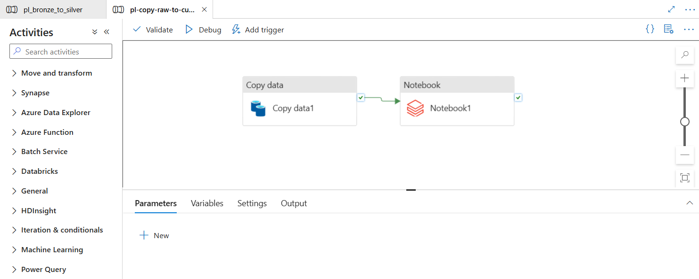
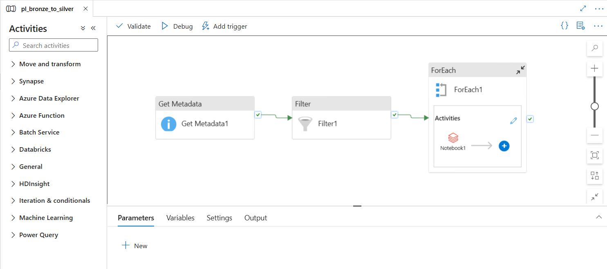
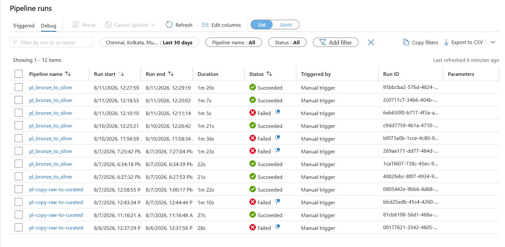

# 🚀 Swiggy Data Intelligence Platform

### End-to-End Azure Data Engineering & Power BI Analytics Platform for Food Delivery Intelligence


---

## 📌 Project Overview

The **Swiggy Data Intelligence Platform** is an end-to-end cloud data engineering and business intelligence project designed to simulate how a food delivery business can collect, process, transform, and analyze operational data using Microsoft Azure.

The primary objective of this project was **not simply to build a Power BI dashboard**, but to gain practical experience designing and implementing a complete cloud-based data workflow.

The platform connects:

**MySQL → Azure Data Factory → Azure Storage → Azure Databricks → Power BI**

The resulting data pipeline transforms operational data into structured, business-ready datasets and interactive dashboards covering customers, restaurants, deliveries, orders, and overall business performance.

The project combines:

- ☁️ Microsoft Azure cloud services
- 🔄 Azure Data Factory pipelines
- 🗄️ Azure Storage
- 🔥 Azure Databricks
- 🧮 SQL-based analysis
- 📊 Power BI dashboards
- 💡 Business insights and recommendations

---

## 🎯 Project Objectives

The project was built with the following learning objectives:

- Understand how an end-to-end cloud data platform is structured
- Learn Azure Data Factory and pipeline orchestration
- Move data from a source database into cloud storage
- Understand Bronze, Silver, and Gold data-layer concepts
- Perform data transformation using Azure Databricks
- Use SQL for analytical querying and metric generation
- Monitor and validate data pipeline executions
- Build analytical datasets for Power BI
- Design business-focused dashboards
- Convert analytical findings into actionable business recommendations

### 🎓 Primary Learning Goal

The core goal of this project was to understand **how cloud data engineering and business intelligence fit together in a real-world analytics workflow**.

Rather than treating Power BI as an isolated reporting tool, the project follows the complete journey:

**Source Data → Cloud Ingestion → Storage → Transformation → Analytics → Visualization → Business Decisions**

---
# 🏗️ Solution Architecture

The project follows an end-to-end cloud data architecture designed to move operational food-delivery data from the source system through ingestion, cloud storage, transformation, and analytics.

The architecture separates the platform into distinct layers so that data can be ingested, processed, validated, and consumed for business intelligence.

## Architecture Overview

The solution follows this flow:

~~~text
┌─────────────────────────┐
│      MySQL Database     │
│   Operational Source    │
└────────────┬────────────┘
             │
             ▼
┌─────────────────────────┐
│   Azure Data Factory    │
│ Ingestion & Orchestration│
└────────────┬────────────┘
             │
             ▼
┌─────────────────────────┐
│      Azure Storage      │
│                         │
│  Raw / Bronze           │
│  Curated / Silver       │
│  Gold                   │
└────────────┬────────────┘
             │
             ▼
┌─────────────────────────┐
│    Azure Databricks     │
│                         │
│  Data Cleaning          │
│  Transformation         │
│  SQL Analysis           │
└────────────┬────────────┘
             │
             ▼
┌─────────────────────────┐
│        Power BI         │
│                         │
│  Dashboards             │
│  KPIs                   │
│  Business Insights      │
└─────────────────────────┘
~~~

## Architecture Layers

### 1. Source Layer — MySQL

The operational data originates from a MySQL database containing food-delivery business data.

The source layer represents the transactional environment from which analytical data is extracted.

Key datasets include:

- Customers
- Restaurants
- Orders
- Deliveries
- Payments
- Discounts
- Order status

### 2. Ingestion & Orchestration Layer — Azure Data Factory

**Azure Data Factory (ADF)** acts as the orchestration layer of the platform.

It is responsible for:

- Connecting to the source database
- Moving data into Azure Storage
- Orchestrating data processing workflows
- Triggering Databricks notebooks
- Managing pipeline dependencies
- Monitoring pipeline executions

ADF provides the connection between the operational source and the cloud-based analytical environment.

### 3. Storage Layer — Azure Storage

Azure Storage provides the cloud-based storage layer for the project.

Data is organized into multiple stages:

- **Raw / Bronze** — source-level data retained with minimal transformation
- **Curated / Silver** — cleaned and transformed datasets
- **Gold** — analytics-ready datasets used for reporting

This layered structure helps maintain data organization and supports a clear data-processing lifecycle.

### 4. Processing Layer — Azure Databricks

**Azure Databricks** is used as the primary data processing and transformation environment.

Databricks notebooks perform:

- Data cleaning
- Data transformation
- Data preparation
- Aggregation
- SQL-based analysis
- Business metric generation

The processing layer converts the stored operational data into structured datasets suitable for analytical consumption.

### 5. Analytics Layer — Power BI

**Power BI** acts as the final analytics and visualization layer.

The processed data is used to create interactive dashboards covering:

- Executive performance
- Customer analytics
- Restaurant analytics
- Delivery analytics
- Order analytics
- Root-cause analysis
- Business insights and recommendations

The dashboards allow users to move from high-level KPIs to detailed operational analysis.

## Architectural Design Principle

The platform follows a layered approach:

**Source → Ingestion → Storage → Transformation → Analytics**

This separation makes the workflow easier to understand, maintain, monitor, and extend.

The architecture also demonstrates how cloud services can be combined to create a complete data engineering and business intelligence workflow rather than treating dashboard development as an isolated task.

# 🔄 End-to-End Data Flow

The platform follows an end-to-end cloud data workflow that moves operational food-delivery data from the source system through ingestion, storage, transformation, and analytics.

The overall journey is:

**MySQL → Azure Data Factory → Azure Storage → Azure Databricks → Gold Data → Power BI**

---

## 3.1 Source Data

The project begins with operational food-delivery data stored in a MySQL database.

The source data represents different areas of the food-delivery business, including:

- Customers
- Restaurants
- Orders
- Deliveries
- Payments
- Discounts
- Order status

The MySQL database acts as the operational source from which data is extracted for analytical processing.

---

## 3.2 Data Ingestion

Azure Data Factory is responsible for moving data from the source environment into the Azure cloud platform.

The ingestion stage provides the connection between the operational database and the cloud-based data platform.

The process includes:

- Extracting source data
- Moving data into Azure Storage
- Coordinating downstream processing
- Triggering Databricks workflows

This creates a repeatable process for bringing operational data into the analytical environment.

---

## 3.3 Cloud Storage

After ingestion, the data is stored in Azure Storage.

The storage environment is organized into different layers representing different stages of the data lifecycle:

| Layer | Purpose |
|---|---|
| Raw / Bronze | Source-level data with minimal transformation |
| Curated / Silver | Cleaned and transformed datasets |
| Gold | Analytics-ready data for reporting |

This layered approach allows the data to progress from its original form toward progressively refined analytical datasets.

---

## 3.4 Data Transformation

Azure Databricks is used to process and transform the stored data.

The transformation stage includes activities such as:

- Data cleaning
- Data preparation
- Data transformation
- Aggregation
- SQL-based analysis
- Business metric generation

The objective is to convert operational data into structured datasets that are suitable for analytical consumption.

---

## 3.5 Gold Data Layer

The Gold layer represents the final analytics-ready stage of the data pipeline.

Business-level metrics are generated from the processed datasets, including:

- Total Orders
- Total Revenue
- Average Order Value
- Average Delivery Time
- Delivery Rating
- Cancellation Rate
- Restaurant Revenue
- Customer Metrics
- Discount and Coupon Metrics

These datasets form the analytical foundation for the Power BI reporting layer.

---

## 3.6 Business Intelligence Layer

The analytics-ready data is then consumed by Power BI.

Power BI transforms the processed data into interactive dashboards covering:

1. Executive Overview
2. Customer Analytics
3. Restaurant Analytics
4. Delivery Analytics
5. Order Analytics
6. Deep Dive
7. Insights & Actions

The reporting layer allows users to move from high-level KPIs to detailed operational investigation.

---

## 3.7 Complete Data Journey

The complete data journey can be summarized as:

```text
Operational MySQL Data
          ↓
Azure Data Factory
          ↓
Azure Storage
Raw / Bronze
          ↓
Curated / Silver
          ↓
Azure Databricks
Cleaning + Transformation + SQL
          ↓
Gold Analytics Layer
          ↓
Power BI
Dashboards + KPIs
          ↓
Business Insights & Actions
```

---

## 3.8 From Data to Decision

The platform follows a simple progression:

**Data → Processing → Metrics → Visualization → Insight → Action**

This means the project does not stop at storing or transforming data.

The final objective is to convert operational information into business intelligence that can support decisions related to:

- Delivery performance
- Customer behavior
- Restaurant performance
- Order value
- Promotions
- Cancellations
- Operational bottlenecks

---

## 3.9 Why the End-to-End Flow Matters

Understanding the complete data journey was one of the primary learning objectives of this project.

Instead of treating data ingestion, transformation, SQL analysis, and dashboarding as separate tasks, the project connects them into a single cloud-based workflow.

This provided practical experience with the complete lifecycle:

**Source → Ingestion → Storage → Transformation → Analytics → Business Decision**


# ☁️ Azure Data Engineering

The core objective of this project was to gain practical experience building a cloud-based data engineering workflow using Microsoft Azure.

Azure services were used to handle data ingestion, cloud storage, orchestration, transformation, and monitoring before the data reached the Power BI analytics layer.

---


## 4.1 Azure Resource Architecture

The project was organized within an Azure Resource Group containing the primary services used throughout the platform.

The main Azure resources include:

- Azure Data Factory
- Azure Databricks
- Azure Storage
- Azure Database for MySQL


This setup provided a centralized environment for managing the different components of the data platform.

---

## 4.2 Azure Data Factory

Azure Data Factory was used as the orchestration and pipeline layer.

The pipelines coordinate the movement of data between the source system, cloud storage, and Databricks processing environment.

The project includes workflows for:

- Source data ingestion
- Data movement
- Databricks notebook execution
- Dataset-level processing
- Pipeline monitoring

ADF therefore acts as the control layer that coordinates the overall data workflow.

---

## 4.3 Data Ingestion Pipelines

The first stage of the Azure workflow involves moving operational data into the cloud environment.

The Raw → Curated workflow uses:

**Copy Data → Databricks Notebook**

The Copy Data activity moves the required data into the Azure processing environment, after which the Databricks notebook performs the required transformation.



---

## 4.4 Metadata-Driven Processing

A second pipeline was implemented to demonstrate more dynamic processing.

The Bronze → Silver workflow follows:

**Get Metadata → Filter → ForEach → Databricks Notebook**

The workflow uses metadata and filtering logic before iterating through the required datasets and triggering Databricks processing.



This approach demonstrates how pipeline workflows can be designed to process multiple datasets without manually creating an independent workflow for every dataset.

---

## 4.5 Azure Storage

Azure Storage acts as the cloud storage layer of the platform.

The storage account contains separate containers representing different stages of the data lifecycle:

- Raw data
- Curated data
- Gold data
- Pipeline logs


Separating the storage layers makes it easier to organize the data as it moves from ingestion through transformation and analytical consumption.

---

## 4.6 Azure Databricks

Azure Databricks provides the data processing environment.

Databricks notebooks were used for:

- Data cleaning
- Data transformation
- Data preparation
- SQL analysis
- Aggregation
- Metric generation

The notebooks combine Python-based processing with SQL queries to prepare the datasets required for analytics.


---

## 4.7 SQL-Based Analytics

SQL was used within the Databricks environment to calculate analytical metrics from the processed datasets.

Examples include:

- Total Orders
- Total Revenue
- Average Order Value
- Total Discounts
- Total Delivery Fees

This provided practical experience using SQL not only for querying data, but also for generating business metrics that could be consumed by the reporting layer.

---

## 4.8 Pipeline Monitoring

Azure Data Factory monitoring was used to track pipeline executions and identify successful and failed runs.

The monitoring view provides information such as:

- Pipeline name
- Run start time
- Run end time
- Execution duration
- Execution status
- Trigger method
- Run ID



Monitoring pipeline execution is an important part of a production-style data workflow because it helps identify failures and verify that downstream processing has completed successfully.

---

## 4.9 Azure Data Engineering Workflow

The Azure portion of the project can be summarized as:

**MySQL → Azure Data Factory → Azure Storage → Azure Databricks → Gold Data → Power BI**

Each service performs a specific role:

| Azure Component | Role |
|---|---|
| Azure Data Factory | Data ingestion and orchestration |
| Azure Storage | Cloud data storage |
| Azure Databricks | Data processing and transformation |
| Azure Database for MySQL | Operational source database |
| Power BI | Analytics and business intelligence |

---

## 4.10 Key Azure Learning Outcomes

Building this platform provided practical exposure to several cloud data engineering concepts:

- Designing an end-to-end cloud data workflow
- Working with Azure Resource Groups
- Using Azure Data Factory for orchestration
- Creating and monitoring data pipelines
- Working with Azure cloud storage
- Understanding Raw, Curated, and Gold data layers
- Using Azure Databricks for transformation
- Running SQL analysis in Databricks
- Connecting data engineering workflows to Power BI
- Understanding how different cloud services work together

The main learning outcome was understanding the complete journey of data through a cloud-based platform rather than learning each Azure service in isolation.

# 📊 Power BI Analytics Platform

The final stage of the platform is the **Power BI business intelligence layer**.

After the data was ingested, stored, transformed, and prepared through the Azure data workflow, Power BI was used to turn the resulting datasets into an interactive analytical report.

The report contains **7 pages**, each designed around a specific business perspective.

---

## 📌 Dashboard Structure

The Power BI report is organized into the following analytical areas:

| Page | Focus |
|---|---|
| **1. Executive Overview** | Overall business performance |
| **2. Customer Analytics** | Customer behaviour and value |
| **3. Restaurant Analytics** | Restaurant and cuisine performance |
| **4. Delivery Analytics** | Delivery operations and delays |
| **5. Order Analytics** | Order behaviour and transaction patterns |
| **6. Deep Dive** | Interactive root-cause investigation |
| **7. Insights & Actions** | Key findings and recommended actions |

The navigation panel allows users to move between the different analytical perspectives and explore the data progressively.

---

# 1️⃣ Executive Overview

The Executive Overview provides a high-level snapshot of the overall food-delivery operation.

### Key KPIs

- Total Orders
- Total Revenue
- Average Order Value
- Average Delivery Time
- Average Delivery Rating

### Key analysis

- Order and revenue trends
- Monthly performance
- Top-performing restaurants
- Order status distribution
- Overall business performance

This page is designed for quickly understanding the overall health of the business before moving into more detailed analysis.


---

# 2️⃣ Customer Analytics

The Customer Analytics page focuses on customer behaviour, engagement, and value.

### Key analysis

- Customer order frequency
- Repeat customer behaviour
- Customer value
- Customer distribution
- Customer ratings
- High-value customer segments

This page helps identify how customers interact with the platform and where opportunities exist for retention and customer-value improvement.


---

# 3️⃣ Restaurant Analytics

The Restaurant Analytics page evaluates restaurant performance across different dimensions.

### Key analysis

- Top restaurants by revenue
- Restaurant performance by city
- Revenue by cuisine
- Restaurant ratings
- Rating vs revenue
- Restaurant-level comparisons

This analysis helps identify high-performing restaurants, strong cuisines, and differences in restaurant performance across locations.


---

# 4️⃣ Delivery Analytics

The Delivery Analytics page focuses on operational delivery performance.

### Key analysis

- Delivery time by hour
- Delivery time vs distance
- Traffic impact
- Weather impact
- Delivery performance by city
- Delivery delays
- Order status distribution

The page helps investigate the operational conditions associated with longer delivery times.


---

# 5️⃣ Order Analytics

The Order Analytics page focuses on order behaviour and transaction-level patterns.

### Key analysis

- Order volume over time
- Order value distribution
- Average order value
- Discount behaviour
- Coupon usage
- Order status
- Cancellation behaviour

This page provides a detailed view of how customers place orders and how promotions and order outcomes affect overall activity.


---

# 6️⃣ Deep Dive

The Deep Dive page provides an interactive layer for investigating operational drivers in greater detail.

Instead of focusing only on high-level KPIs, this page allows users to investigate specific combinations of business conditions.

### Investigation dimensions

- Traffic
- Weather
- City
- Cuisine
- Restaurant
- Order-level information

### Key analytical questions

- Which conditions are associated with longer delivery times?
- Which cities experience higher delivery times?
- How does traffic affect delivery performance?
- How does weather affect delivery performance?
- Which restaurants experience slower deliveries?

The Deep Dive page therefore acts as a **root-cause analysis layer** within the dashboard.


---

# 7️⃣ Insights & Actions

The final page moves beyond reporting and converts the analysis into potential business actions.

### 🚨 Delivery Risk

High-traffic and rainy conditions are associated with higher delivery times in certain operating conditions.

**Potential action:**  
Prioritize high-risk delivery zones and investigate operational bottlenecks during adverse conditions.

---

### 💰 Order Value Opportunity

A large concentration of orders falls within the **₹200–₹600** order-value range.

**Potential action:**  
Use bundles, add-ons, and cross-selling strategies to increase basket size.

---

### 🎟️ Coupon Usage

Approximately **35% of orders use coupons**, showing that promotional incentives play a meaningful role in customer transactions.

**Potential action:**  
Move from broad discounting toward more targeted promotions for high-value and repeat customers.

---

### ⚠️ Cancellation Risk

Approximately **8.78% of orders are cancelled**.

**Potential action:**  
Investigate cancellation patterns by city, restaurant, delivery conditions, and order stage to identify potential causes.


---

# 📈 Dashboard Design Approach

The dashboard was designed to move from **high-level performance to detailed investigation**.

The analytical journey follows:

**Executive Overview → Business Area → Operational Detail → Root Cause → Action**

This allows different users to approach the dashboard at different levels:

- **Executives** can quickly review overall KPIs.
- **Business teams** can investigate customers, restaurants, and orders.
- **Operations teams** can investigate delivery performance.
- **Analysts** can use the Deep Dive page to investigate potential drivers.
- **Decision-makers** can use the Insights & Actions page to translate findings into recommendations.

---

# 🎯 Power BI Objective

The objective of the Power BI layer was not simply to display charts.

The goal was to create a dashboard that answers three levels of questions:

### What happened?

Performance KPIs and trends.

### Why did it happen?

Customer, restaurant, order, and delivery analysis.

### What should we do?

Insights and recommended business actions.

This creates a progression from:

**Data → Analysis → Insight → Action**


# 🔎 Key Business Insights & Recommended Actions

The dashboard analysis was used to identify operational and commercial patterns within the food-delivery dataset.

Rather than stopping at descriptive metrics, the analysis follows a:

**Finding → Business Impact → Recommended Action → Expected Outcome**

approach.

---

## 📊 Business Performance Snapshot

| KPI | Value | What It Tells Us |
|---|---:|---|
| **Total Orders** | 5,000 | Overall transaction volume |
| **Total Revenue** | ₹2.11M | Overall revenue generated |
| **Average Order Value** | ₹421.73 | Average customer spend per order |
| **Average Delivery Time** | 40.59 min | Overall delivery efficiency |
| **Average Delivery Rating** | 4.02 / 5 | Customer perception of delivery |
| **Coupon Usage** | 35.00% | Customer reliance on promotions |
| **Cancellation Rate** | 8.78% | Potential operational/revenue leakage |

These KPIs provide the baseline for identifying the major business opportunities and operational problems.

---

# 🚴 Insight 1 — Delivery Performance Is an Operational Bottleneck

### 🔍 Finding

The average delivery time is approximately **40.59 minutes**.

The delivery analysis shows that delivery performance varies with operational conditions such as:

- Traffic
- Weather
- Distance
- City
- Time of day

High-traffic and rainy conditions are associated with higher delivery times in certain operating scenarios.

### ⚠️ Business Problem

Longer delivery times can lead to:

- Lower customer satisfaction
- Lower delivery ratings
- Increased cancellation risk
- Higher pressure on delivery partners
- Reduced repeat-order probability

### 💡 Recommended Action

Introduce an **operational risk strategy** for high-delay conditions.

Potential actions:

1. Identify high-delay cities and zones.
2. Increase delivery capacity during high-risk periods.
3. Adjust estimated delivery times dynamically.
4. Monitor traffic and weather conditions during peak hours.
5. Investigate restaurants or locations consistently producing long delivery times.

### 🎯 Expected Outcome

Better delivery-time predictability, improved customer experience, and reduced operational bottlenecks.

---

# 🌧️ Insight 2 — Adverse Conditions Create Predictable Delivery Risk

### 🔍 Finding

The Deep Dive analysis indicates that combinations of **high traffic and rainy weather** can create significantly slower delivery conditions.

This suggests that delivery delays are not purely random; they can be associated with identifiable operating conditions.

### ⚠️ Business Problem

If these conditions are not anticipated, the platform may:

- Underestimate delivery times
- Overload delivery capacity
- Increase customer dissatisfaction
- Experience more cancellations

### 💡 Recommended Action

Create an **operational risk scoring system** based on:

**Traffic + Weather + Distance + Time + City**

High-risk combinations could trigger:

- Additional delivery capacity
- Longer but more realistic ETAs
- Operational alerts
- Temporary zone-level capacity adjustments

### 🎯 Expected Outcome

More accurate ETAs and better allocation of delivery resources during difficult operating conditions.

---

# 💰 Insight 3 — Order Value Has Upselling Potential

### 🔍 Finding

A large concentration of orders falls within the **₹200–₹600** order-value range, while the overall average order value is approximately **₹421.73**.

### ⚠️ Business Problem

If customers frequently place relatively small orders, increasing basket size can provide a revenue opportunity without requiring a proportional increase in customer acquisition.

### 💡 Recommended Action

Introduce targeted basket-building strategies such as:

- Meal bundles
- Add-on recommendations
- Complementary products
- Free-delivery thresholds
- "Add ₹X more" recommendations
- Personalized restaurant suggestions

### 🎯 Expected Outcome

Higher average order value and increased revenue per existing customer.

---

# 🎟️ Insight 4 — High Coupon Usage Indicates Promotional Dependency

### 🔍 Finding

Approximately **35% of orders use coupons**.

This indicates that promotional incentives have a meaningful role in customer transactions.

### ⚠️ Business Problem

Broad discounting can reduce margins if customers receive discounts even when they would have purchased without them.

The key question is therefore not:

> "How can we give more discounts?"

but:

> **"Which customers actually need an incentive to purchase?"**

### 💡 Recommended Action

Move toward **targeted promotional strategies**.

For example:

| Customer Segment | Potential Strategy |
|---|---|
| High-value customers | Loyalty rewards |
| Frequent customers | Personalized offers |
| Inactive customers | Reactivation coupons |
| New customers | First-order incentives |
| Low-value customers | Minimum-order-value offers |

### 🎯 Expected Outcome

Better promotional efficiency while maintaining customer engagement and reducing unnecessary discount expenditure.

---

# ⚠️ Insight 5 — Cancellation Rate Represents Revenue Leakage

### 🔍 Finding

Approximately **8.78% of orders are cancelled**.

With 5,000 orders, this represents a meaningful portion of the order base that does not successfully reach completion.

### ⚠️ Business Problem

Cancellations can result in:

- Lost revenue
- Wasted operational effort
- Customer dissatisfaction
- Lower customer retention
- Increased support requirements

### 💡 Recommended Action

Build a cancellation analysis framework that segments cancellations by:

- City
- Restaurant
- Traffic
- Weather
- Order stage
- Delivery conditions
- Customer behaviour

The highest-risk combinations can then be investigated individually.

### 🎯 Expected Outcome

Identifying the major cancellation drivers could help reduce avoidable cancellations and recover otherwise lost revenue.

---

# 🍽️ Insight 6 — Restaurant Performance Is Uneven

### 🔍 Finding

Restaurant performance varies across:

- Revenue
- Order volume
- Cuisine
- City
- Customer rating

This creates a clear opportunity to identify high-performing and underperforming restaurant segments.

### ⚠️ Business Problem

Treating every restaurant in the same way may result in inefficient partner management and missed growth opportunities.

### 💡 Recommended Action

Segment restaurants into performance groups:

**High Revenue + High Rating**

→ Prioritize retention and premium partnerships.

**High Revenue + Low Rating**

→ Investigate customer experience issues.

**Low Revenue + High Rating**

→ Explore visibility, discovery and promotional opportunities.

**Low Revenue + Low Rating**

→ Review performance and consider improvement plans.

### 🎯 Expected Outcome

More targeted restaurant-partner strategies and better allocation of promotional and operational resources.

---

# 👥 Insight 7 — Customer Value Can Drive Better Retention Strategies

### 🔍 Finding

Customer behaviour analysis shows differences in ordering frequency and customer value.

Not every customer contributes equally to platform revenue.

### ⚠️ Business Problem

A single marketing strategy for every customer can result in:

- Unnecessary promotional spending
- Poor retention targeting
- Missed opportunities with high-value customers

### 💡 Recommended Action

Develop customer segments based on:

- Order frequency
- Total spend
- Average order value
- Recency
- Coupon behaviour

Potential segments include:

- High-value loyal customers
- Frequent customers
- New customers
- Inactive customers
- Promotion-sensitive customers

### 🎯 Expected Outcome

More personalized retention campaigns and improved customer lifetime value.

---

# 📌 Priority Action Matrix

Based on the insights identified in the analysis, the following actions could be prioritized:

| Business Issue | Priority | Recommended Action | Expected Outcome |
|---|---|---|---|
| Delivery delays | 🔴 High | Optimize high-risk zones and periods | Better delivery performance |
| High-risk weather/traffic | 🔴 High | Dynamic capacity and ETA adjustments | More predictable deliveries |
| Order cancellations | 🔴 High | Identify cancellation drivers | Lower revenue leakage |
| Promotional dependency | 🟠 Medium | Target coupons by customer segment | Better promotion efficiency |
| Order value | 🟠 Medium | Bundles and add-ons | Higher AOV |
| Restaurant performance | 🟠 Medium | Segment partners by performance | Better partner strategy |
| Customer retention | 🟡 Medium | Personalized customer segments | Higher customer value |

---

# 🎯 Overall Business Opportunity

The analysis suggests that the biggest opportunities are not necessarily about generating more orders.

Instead, the platform can create value by improving the **quality and efficiency of existing operations**:

### 1. Deliver faster

Reduce delays in high-risk operating conditions.

### 2. Lose fewer orders

Investigate and reduce avoidable cancellations.

### 3. Earn more per order

Use targeted upselling and basket-building strategies.

### 4. Spend promotions more intelligently

Target customers who are most likely to respond to incentives.

### 5. Retain valuable customers

Focus retention efforts on high-frequency and high-value customer segments.

---

# 💡 From Dashboard to Decision

The key objective of the analytics layer is to move beyond:

**"Here is what the data says."**

and toward:

**"Here is what the data suggests the business should do."**

The project therefore follows the analytical progression:

**Data → Finding → Problem → Recommendation → Expected Outcome**

This transforms the Power BI dashboard from a reporting tool into a decision-support platform.


# 🧠 Technical Learning & Project Outcomes

This project was designed as a hands-on learning experience to understand how a cloud-based data platform works from end to end.

Rather than learning Azure services individually, the project focused on understanding how different components work together within a complete data workflow.

---

## ☁️ Azure Cloud

Gained practical exposure to building and managing a data platform using Microsoft Azure.

Key areas explored:

- Azure Resource Groups
- Azure Data Factory
- Azure Storage
- Azure Databricks
- Cloud-based data workflows
- Azure service integration

The project helped build an understanding of how different managed cloud services can work together to support a data engineering solution.

---

## 🔄 Azure Data Factory

Developed hands-on experience with data pipeline orchestration.

Key concepts explored:

- Linked services
- Datasets
- Copy Data activity
- Get Metadata activity
- Filter activity
- ForEach activity
- Databricks Notebook activity
- Pipeline execution
- Pipeline monitoring

A key learning outcome was understanding the difference between individual pipeline activities and the complete workflow they form.

---

## 🗄️ Cloud Data Storage

Gained practical experience organizing data into different stages of the data lifecycle.

The project introduced the concepts of:

**Raw / Bronze → Curated / Silver → Gold**

This helped demonstrate why raw data should be separated from transformed and business-ready datasets.

---

## 🔥 Azure Databricks

Developed practical experience using Azure Databricks as a data processing environment.

Key areas explored:

- Notebook-based data processing
- Data transformation
- Data cleaning
- SQL querying
- Aggregation
- Business metric generation
- Analytical validation

The project also provided experience working with Databricks as the bridge between cloud-stored data and the analytical reporting layer.

---

## 🧮 SQL Analytics

SQL was used to explore datasets and generate business metrics.

The project provided hands-on practice with:

- Aggregations
- Filtering
- Grouping
- Calculated metrics
- Business-oriented queries
- Analytical validation

SQL was used not only to retrieve data, but also to answer business questions and validate dashboard metrics.

---

## 📊 Power BI

Developed a multi-page Power BI reporting platform focused on different business questions.

The dashboard covers:

- Executive performance
- Customer behaviour
- Restaurant performance
- Delivery operations
- Order behaviour
- Root-cause analysis
- Business recommendations

A key learning outcome was understanding that effective dashboards should be designed around **business questions**, rather than simply filling a page with charts.

---

## 🔗 Connecting Data Engineering & BI

One of the most important outcomes of the project was understanding the relationship between data engineering and business intelligence.

The workflow can be viewed as:

**Data Engineering → Data Preparation → Analytics → Visualization → Decision Support**

The quality of the final dashboard depends heavily on how the data is ingested, stored, transformed, and prepared upstream.

---

# 🎯 Project Outcomes

By completing this project, I developed practical exposure to:

- Designing an end-to-end cloud data workflow
- Building Azure Data Factory pipelines
- Working with Azure cloud storage
- Understanding layered data architectures
- Processing data with Azure Databricks
- Writing SQL-based analytical queries
- Monitoring pipeline executions
- Building interactive Power BI dashboards
- Translating analytical findings into business recommendations
- Documenting a technical project using GitHub

---

# 💼 Skills Demonstrated

### Cloud & Data Engineering

**Microsoft Azure • Azure Data Factory • Azure Storage • Azure Databricks**

### Data & Querying

**MySQL • SQL • Data Transformation • Data Cleaning • Data Processing**

### Business Intelligence

**Power BI • KPI Development • Dashboard Design • Business Analysis**

### Analytical Thinking

**Root-Cause Analysis • Insight Generation • Business Recommendations • Decision Support**

---

# 📌 Key Takeaway

The biggest learning from this project was understanding that a successful analytics solution is not just a dashboard.

It is a complete pipeline:

**Source → Ingestion → Storage → Transformation → Analytics → Visualization → Decision**


# 📁 Repository Structure

The repository is organized to keep the project documentation, Power BI report, and supporting screenshots easy to navigate.

```text
swiggy-data-intelligence-platform/
│
├── screenshots/
│   ├── Azure Resource Group.png
│   ├── Azure Storage Containers.png
│   ├── Bronze_Silver_pipeline.png
│   ├── Databricks Transformation.png
│   ├── pipeline_runs.png
│   ├── raw_curated_pipeline.png
│   │
│   ├── Executive Overview.png
│   ├── Customer Analytics.png
│   ├── Restaurant Analytics.png
│   ├── Delivery Analytics.png
│   ├── Order Analytics.png
│   ├── Deep Dive.png
│   └── Insights & Actions.png
│
├── swiggy analytics.pbix
│
└── README.md
```

## 📂 Folder & File Overview

### `screenshots/`

Contains visual evidence of the project implementation, including:

- Azure resource architecture
- Azure Storage configuration
- Azure Data Factory pipelines
- Pipeline execution history
- Databricks transformation
- All 7 Power BI dashboard pages

These screenshots provide supporting evidence for the architecture and analytical workflow documented in this README.

### `swiggy analytics.pbix`

The Power BI report containing the complete interactive dashboard.

The report includes:

- Executive Overview
- Customer Analytics
- Restaurant Analytics
- Delivery Analytics
- Order Analytics
- Deep Dive
- Insights & Actions

### `README.md`

Contains the complete project documentation, including:

- Project overview
- Solution architecture
- End-to-end data flow
- Azure implementation
- Power BI analytics
- Business insights
- Learning outcomes

---

## 🗂️ Repository Design

The repository follows a simple structure:

**Documentation + Power BI Report + Implementation Evidence**

This keeps the main project easy to understand while providing supporting screenshots for the technical components built during the project.

Building the platform end to end provided a practical understanding of how cloud data engineering and business intelligence work together to turn operational data into actionable information.


# 🎯 Conclusion

The Swiggy Data Intelligence Platform demonstrates how a modern cloud-based analytics workflow can transform operational food-delivery data into actionable business intelligence.

The project combines:

**MySQL → Azure Data Factory → Azure Storage → Azure Databricks → SQL Analytics → Power BI**

The main focus of the project was not simply to create a dashboard, but to gain practical experience in building an **end-to-end Azure data platform** and understanding how data moves from an operational source to a business decision.

The project provided hands-on exposure to:

- Cloud data engineering
- Data ingestion and orchestration
- Layered cloud storage
- Data transformation
- SQL-based analytics
- Pipeline monitoring
- Business intelligence
- Dashboard development
- Business insight generation

The final Power BI platform brings these components together to analyze **customers, restaurants, deliveries, orders, and overall business performance**.

Most importantly, the project helped bridge the gap between **technical data engineering and business-oriented analytics**:

> **Raw Data → Reliable Data → Analytical Data → Business Insight → Action**

---

# 👤 Author

### Dhananjay Lingam

Aspiring **Data Analyst / Business Analyst** with an interest in:

- Data Analytics
- Business Intelligence
- Cloud Data Engineering
- Microsoft Azure
- SQL
- Power BI

This project represents a hands-on learning journey into building cloud-based analytics solutions using Azure and Power BI.

### 🔗 Connect

- **GitHub:** [Jay-Lingam](https://github.com/Jay-Lingam)
- **LinkedIn:** [Dhananjay Lingam](https://www.linkedin.com/)

---

⭐ If you found this project useful or interesting, feel free to explore the repository and the Power BI dashboard.
